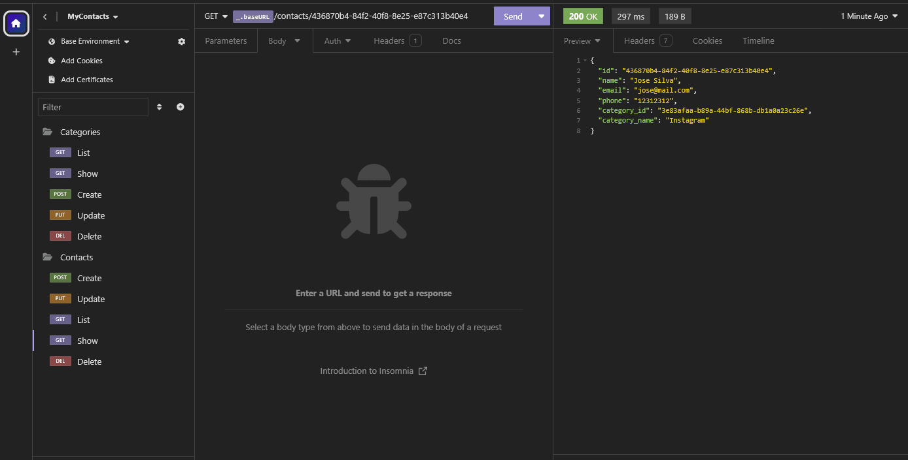
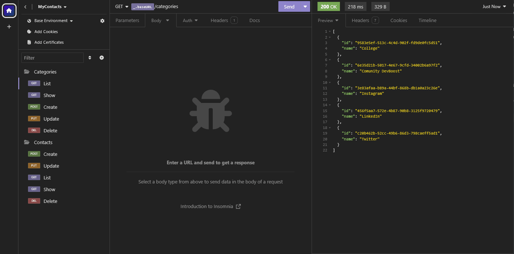

<h1 align="center">
    
    myContacts API
</h1>
 

 <a href="#-about">About</a> |
 <a href="#-routes">Routes</a> |
 <a href="#-technologies">Technologies</a> |

## 💻 About

A CRUD application was developed using Node.js and Express to manage contacts and categories. The application includes route validation and error handling. Docker was utilized to deploy a PostgreSQL database container.

 

## 🔀 Routes
 

</img>
</img>

> Note: All parameters sent and received in the request and response body are in `JSON` format."

